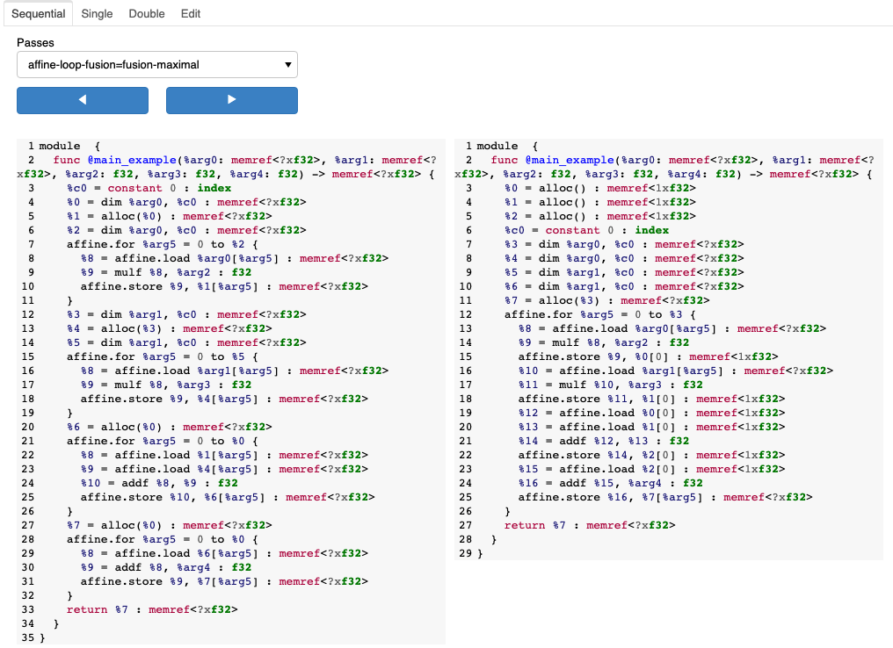
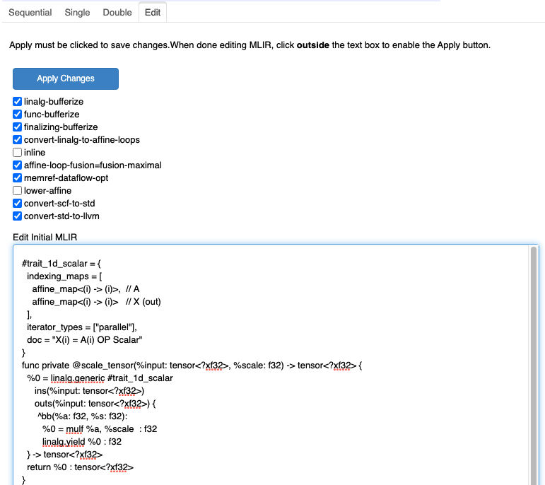

.. _explorer:

MLIR Explorer
=============

The MLIR Explorer is the preferred way to view ``DebugResults``.

The usual way to open the explorer is by calling

.. code-block:: python

    result.explore()

This will open a new browser tab showing the Explorer linked to ``result``.

Another option, when running from a Jupyter notebook, is to use embedded mode.

.. code-block:: python

    result.explore(embed=True)

This will open the explorer directly in the notebook.

Note that for this to work in JupyterLab,
the `pyviz lab extension <https://www.npmjs.com/package/@pyviz/jupyterlab_pyviz>`_ must be installed.

Explorer Interface
------------------

The primary view of the Explorer is on the **Sequential** tab. This shows the result of each pass,
with the input on the left panel and the result on the right panel.

Walking through each pass can be accomplished by clicking the left and right arrows or by using the "Passes"
dropdown widget.

Code lines which are too wide will be wrapped to fit in the available width.

The **Single** tab contains the same "Passes" dropdown widget and provides more screen width for viewing
a single code panel.

The **Double** tab provides two dropdown selectors, allowing a comparison of arbitrary passes next to each other.

Styling
~~~~~~~

.. image:: explorer_topbar.png

The top bar of the Explorer contains styling options for the displayed code.

Line numbers can be toggled on or off. Having line numbers generally makes the code easier to compare or
discuss with another person. However, selecting and copying the code will include the line numbers. When
copying is required, toggle the line numbers off.

Syntax highlighting helps differentiate things like keywords, punctuation, variable names, and comments.
The actual highlighting style based on these tokens can be changed. Several light-mode and dark-mode
options are available in the dropdown.

The chosen styles are not saved when exiting the Explorer.

Live Editing
------------

When developing code, an iterative workflow is common. To avoid the need to close the Explorer tab,
edit input code, re-run the CLI tool, and re-explore every time, an **Edit** tab is provided.

The primary purpose of the edit tab is to change the input MLIR code. After editing, click anywhere outside the
code text editor and the **Apply Changes** button will become active. Clicking this button will regenerate the
content of the other tabs based on this new input.

Another edit that can be performed is to disable passes. Reordering or adding new passes is not available
currently. You must **Apply Changes** after deselecting or reselecting passes to regenerate the
content of the other tabs.
